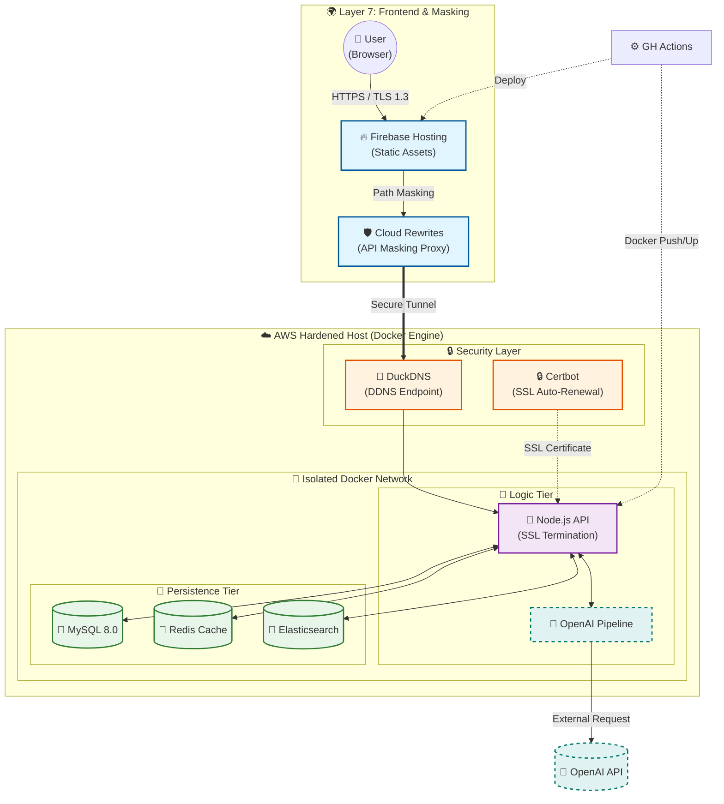

# 🕯️ 연등 - 백엔드 레포지토리
```textplain
〔  ＼│/  〕   흩어진 연대를 잇는 따뜻한 불빛
(  연  등  )   연대 활동 정보의 모든 것, 
 "*. __ .*"    지금 바로 [연등]에서 확인하세요.
```
## 팀원 소개
| 홍서현 | 곽해림 | 송서현 |
|--------|--------|--------|
| BE Lead     | BE     | BE     |
| [@SH38038038](https://github.com/SH38038038) | [@Tulipurple](https://github.com/Tulipurple) | [@Hiimynameiss](https://github.com/Hiimynameiss) |
|  |  |  

# 시스템 아키텍처

