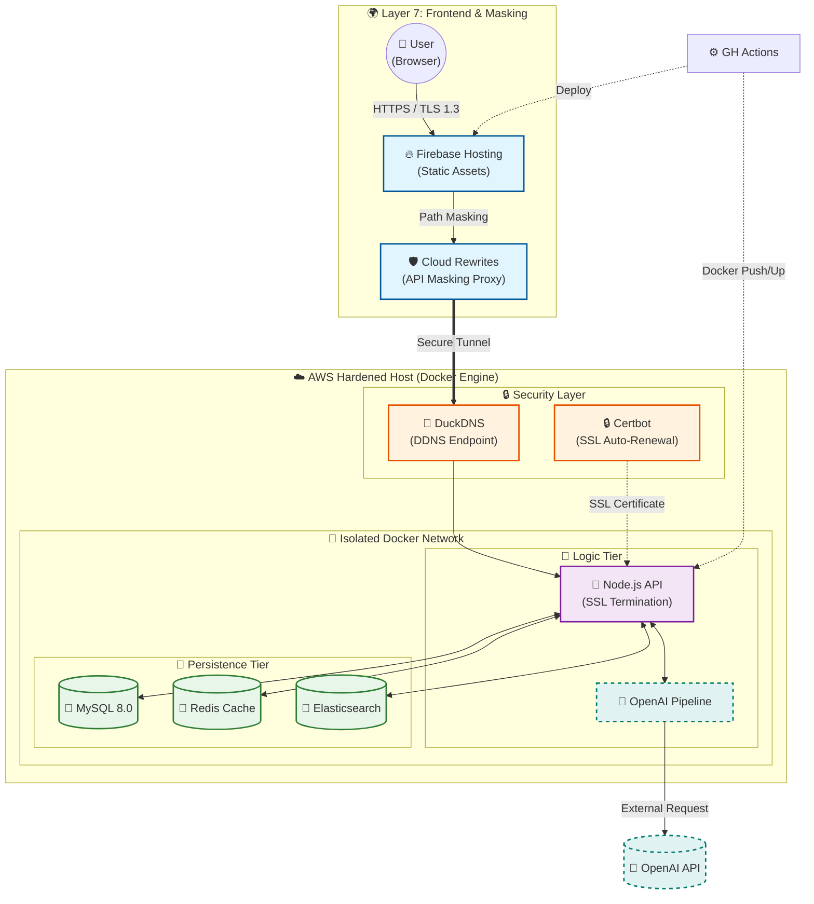

# 🕯️ 연등 - 백엔드 레포지토리
```textplain
〔  ＼│/  〕   흩어진 연대를 잇는 따뜻한 불빛
(  연  등  )   연대 활동 정보의 모든 것, 
 "*. __ .*"    지금 바로 [연등]에서 확인하세요.
```

## 👥 팀원 소개
| 홍서현 | 곽해림 | 송서현 |
| :---: | :---: | :---: |
| **BE Lead** | **BE** | **BE** |
| [@SH38038038](https://github.com/SH38038038) | [@Tulipurple](https://github.com/Tulipurple) | [@Hiimynameiss](https://github.com/Hiimynameiss) |
|  |  |  |
| <small>🔎 인증 · 검색 · 배포</small> | <small>🤖 LLM · 크롤링 · 메일</small> | <small>📝 게시글 · 알림 · 관리자</small> |

---

## 🛠️ 기술 스택 (Tech Stack)

| Category                 | Technology                                                                                                                                                                                                                         | Reason                             |
| :----------------------- | :--------------------------------------------------------------------------------------------------------------------------------------------------------------------------------------------------------------------------------- | :--------------------------------- |
| 🧑‍💻 **Backend**        | <a></a><br><a></a> | REST API 서버 구성 및 비동기 기반 고성능 요청 처리  |
| 💾 **Database / Cache**  | <a></a><br><a></a>           | 관계형 데이터 영속화 및 인메모리 캐시를 통한 응답 성능 개선 |
| 🔎 **Search**            | <a></a>                                                                                                         | 한글 형태소 분석 기반 대용량 텍스트 인덱싱 및 검색 최적화  |
| 🤖 **AI / Intelligence** | <a></a>                                                                                                                       | 사용자 입력 분석 및 자동 응답 · 가이드 생성 기능 구현   |
| ☁️ **Infra**             | <a></a><br><a></a>       | 컨테이너 기반 서비스 배포 및 격리된 실행 환경 구성      |
| 🌐 **Network**           | <a></a>                                                                                                                   | 클라이언트 요청 프록시 처리로 백엔드 엔드포인트 은닉      |
| 🔒 **Security**          | <a></a>                                                                                                           | HTTPS 인증서 자동 발급 및 갱신을 통한 전 구간 암호화  |

---

## 🧩 시스템 아키텍처


